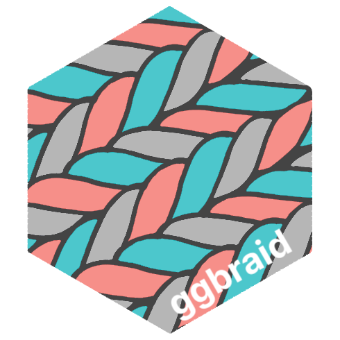
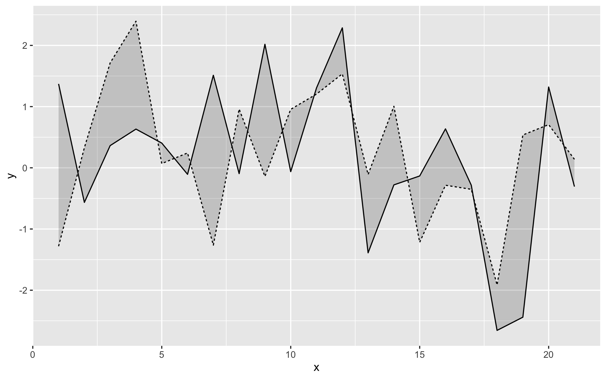
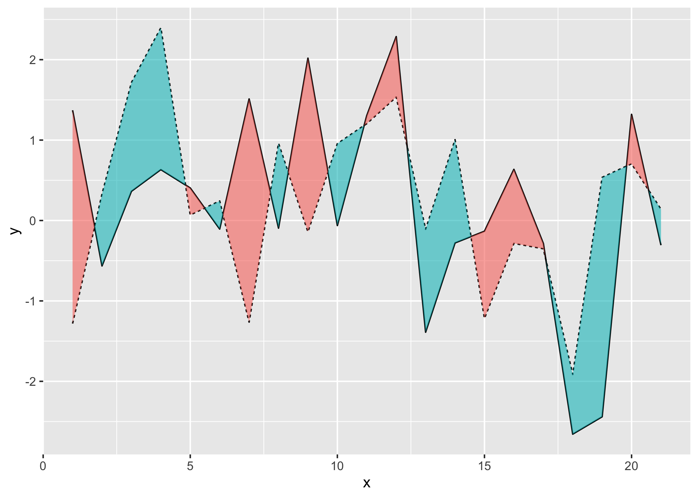

<!-- README.md is generated from README.Rmd. Please edit that file -->

# ggbraid 

<!-- badges: start -->
<!-- badges: end -->

ggbraid provides a new stat, `stat_braid()`, that extends the
functionality of `geom_ribbon()` to correctly fill the area between two
alternating lines (or steps) with two different colors. ggbraid also
provides a geom, `geom_braid()`, that wraps `geom_ribbon()` and uses
`stat_braid()` by default.

## Installation

You can install the development version of ggbraid from GitHub with:

``` r
# install.packages("remotes")
remotes::install_github("nsgrantham/ggbraid")
```

## Usage

To demonstrate, let’s generate a long dataset with two alternating
series.

``` r
library(ggplot2)
library(ggbraid)
library(tidyr)

set.seed(42)  # for reproducibility

n <- 21

df_long <- tibble(
  x = c(1:n, 1:n),
  y = c(rnorm(n), rnorm(n, mean = 0.5)),
  z = c(rep("a", n), rep("b", n))
)

df_long
#> # A tibble: 42 × 3
#>        x       y z    
#>    <int>   <dbl> <chr>
#>  1     1  1.37   a    
#>  2     2 -0.565  a    
#>  3     3  0.363  a    
#>  4     4  0.633  a    
#>  5     5  0.404  a    
#>  6     6 -0.106  a    
#>  7     7  1.51   a    
#>  8     8 -0.0947 a    
#>  9     9  2.02   a    
#> 10    10 -0.0627 a    
#> # … with 32 more rows
```

And let’s pivot the dataset wider so we can use it with `geom_ribbon()`
and `geom_braid()`.

``` r
df_wide <- pivot_wider(df_long, names_from = z, values_from = y)

df_wide
#> # A tibble: 21 × 3
#>        x       a       b
#>    <int>   <dbl>   <dbl>
#>  1     1  1.37   -1.28  
#>  2     2 -0.565   0.328 
#>  3     3  0.363   1.71  
#>  4     4  0.633   2.40  
#>  5     5  0.404   0.0695
#>  6     6 -0.106   0.243 
#>  7     7  1.51   -1.26  
#>  8     8 -0.0947  0.960 
#>  9     9  2.02   -0.140 
#> 10    10 -0.0627  0.955 
#> # … with 11 more rows
```

Now let’s draw the two series as lines and fill the area between them
with a single color using `geom_ribbon()`.

``` r
ggplot() +
  geom_line(aes(x, y, linetype = z), data = df_long) +
  geom_ribbon(aes(x, ymin = a, ymax = b), data = df_wide, alpha = 0.2) +
  guides(linetype = "none")
```



Can we fill the area between the two lines with two different colors?
One color when the solid line is *above* the dashed line, and a
different color when the solid line is *below* the dashed line?

That shouldn’t be hard. Let’s map `a < b` to the `fill` aesthetic in
`geom_ribbon()` and…

``` r
ggplot() +
  geom_line(aes(x, y, linetype = z), data = df_long) +
  geom_ribbon(aes(x, ymin = a, ymax = b, fill = a < b), data = df_wide, alpha = 0.6) +
  guides(linetype = "none", fill = "none")
```


Chaos. What happened?

This is the “Unbraided Ribbon Problem”.

Not to worry, we can braid the unbraided ribbon with ggbraid — simply
replace `geom_ribbon()` with `geom_braid()`.

``` r
ggplot() +
  geom_line(aes(x, y, linetype = z), data = df_long) +
  geom_braid(aes(x, ymin = a, ymax = b, fill = a < b), data = df_wide, alpha = 0.6) +
  guides(linetype = "none", fill = "none")
#> `geom_braid()` using method = 'line'
```



## Articles

-   For an introduction to ggbraid and the “Unbraided Ribbon Problem”,
    see [Average Daily
    Temperatures](https://nsgrantham.github.io/ggbraid/articles/temps.html).

-   To learn how to use `geom_braid()` with `geom_step()`, see [NBA
    Finals
    Game](https://nsgrantham.github.io/ggbraid/articles/hoops.html).

-   ggbraid supports flipped aesthetics, see [US Supreme
    Court](https://nsgrantham.github.io/ggbraid/articles/court.html).
